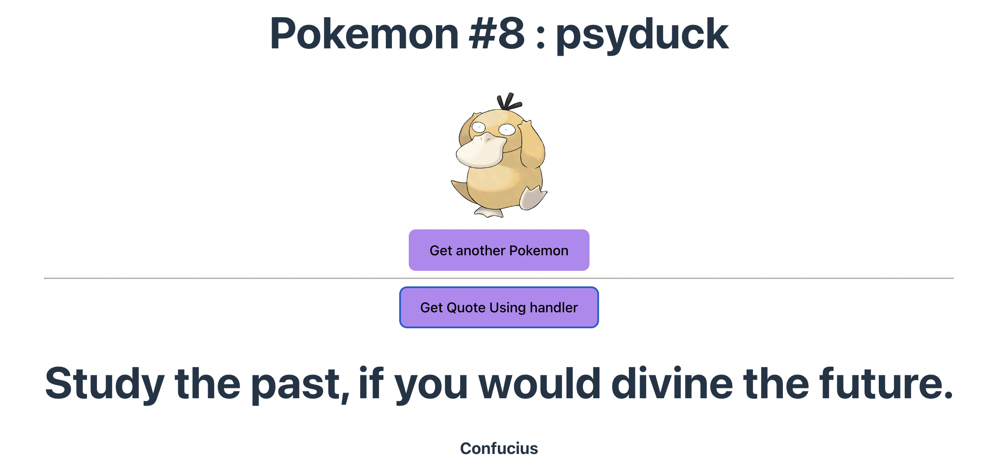

# FunFrontEndPage

Use this cute website to enlighten your day: fetch a cute Pokemon at each button click. Also, fetch some inspirational quotes to get wiser!

## Running the Webpage Locally

Follow these steps to run the webpage locally on your machine:

1. **Install Node.js**:
   - Download and install Node.js in your system

2. **Check npm Installation**:
   - Open a terminal and run `npm -v` to check if npm is installed.

3. **Install Dependencies**:
   - Navigate to the project directory in the terminal.
   - Run `npm install` to install project dependencies listed in `package.json`.

4. **Run Development Server**:
   - After installing dependencies, run `npm run dev` to start the development server. You are going to see the following screenshot:

5. **View Webpage**:
   - Open a web browser and navigate to `localhost:5173`.
   - You'll see your webpage rendered in the browser.

That's it! Enjoy exploring this webpage.
